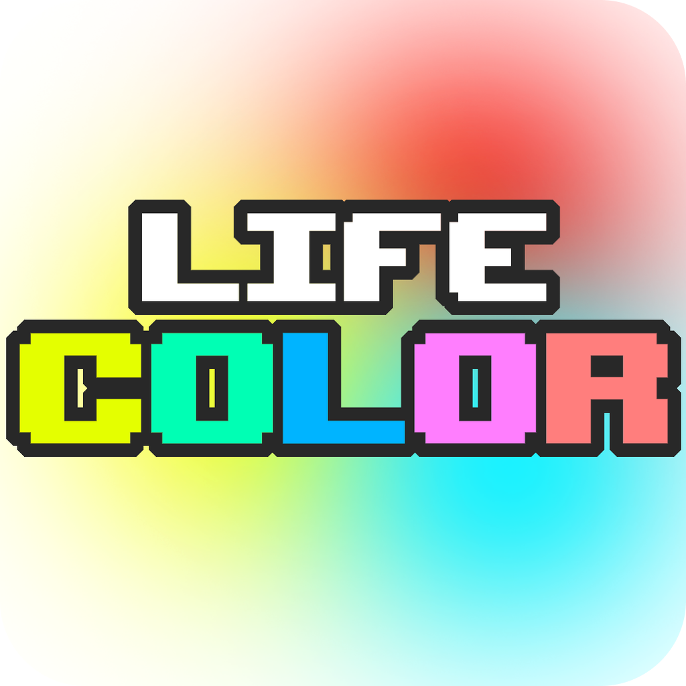
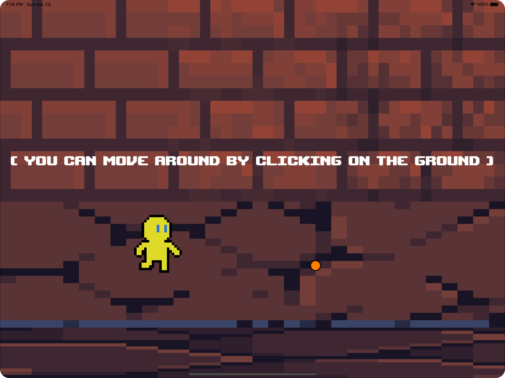
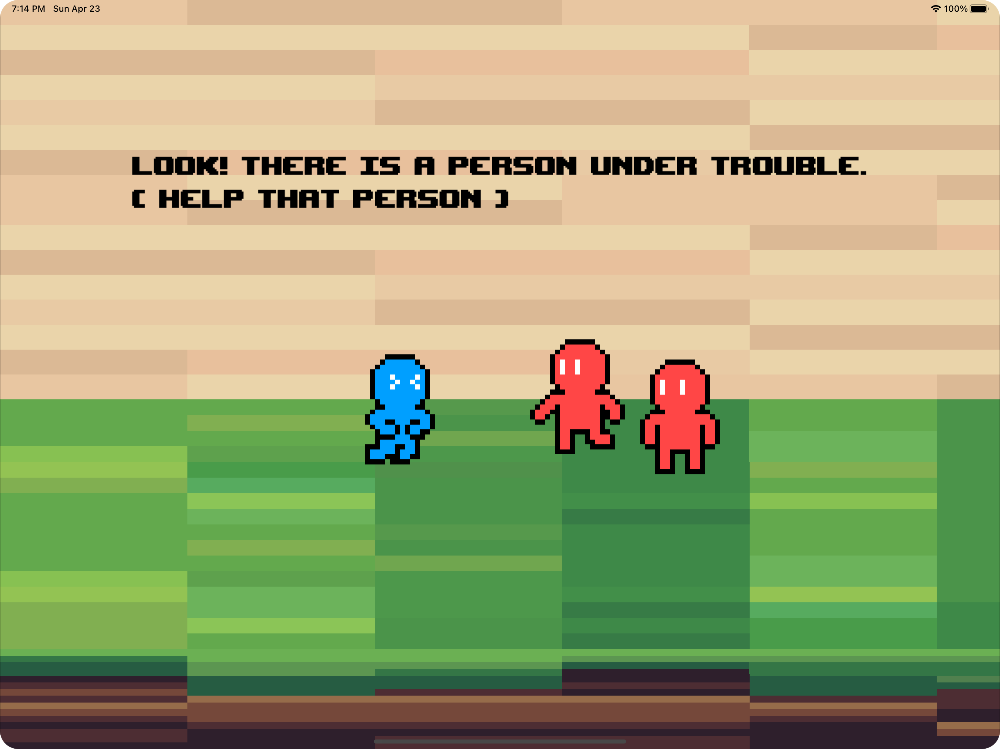

  
  
# 🎨 Life Color
An education game about Discrimination that built on Swift Playground App.
> This game is also my submission for my 
[WWDC 2023 Swift Student Challenge](https://developer.apple.com/wwdc23/swift-student-challenge/).
  
## ℹ️ About Life Color
The game itself is about Discriminations in general. As we all know, we live in a world of discrimination. Nowadays, a lot of people still being the victim of discrimination. Many of them also get treated poorly and get depressed affecting their physical and mental health. 

Because of this, we need to raise our awareness and take action. So that people can live happily and peacefully.

## 🧬 Technologies
- **Swift** - Programming Language
- **SwiftUI** - UI Framework
- **SpriteKit** - 2D Game Framework. _Sprite, Audio, Animation, and Gesture_

## 🏃‍♂️ How to Run
1. Download / Clone this repository
2. Open `life-color.swiftpm` in [Xcode](https://developer.apple.com/xcode/) or [Swift Playgrounds](https://www.apple.com/swift/playgrounds/)
3. Run & enjoy this project 😉

## 👁️ Preview
  
  

## 🔖 Credit
- [Font] Upheaval by [AENIGMATE](https://warrenwoodhouse.webs.com/fonts/aenigmate/)
- [Sprite] Brick Tile by [alpha_rats](http://alpharats.com/) 
- [Sprite] Texture by [PiiiXL](https://piiixl.itch.io/)
- [BGM] globin_den.wav & plain_sight.wav by [MiniFantasy](https://www.minifantasy.net/)
- [BGM] menu.wav by [GooseNinja](https://gooseninja.itch.io/)
